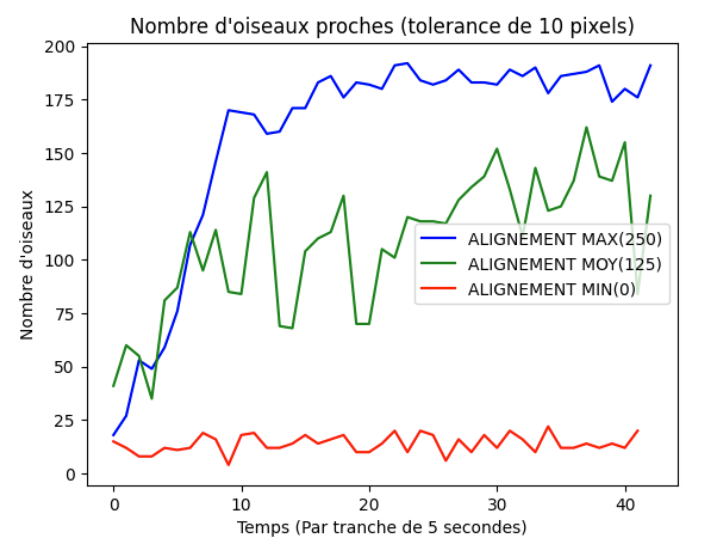
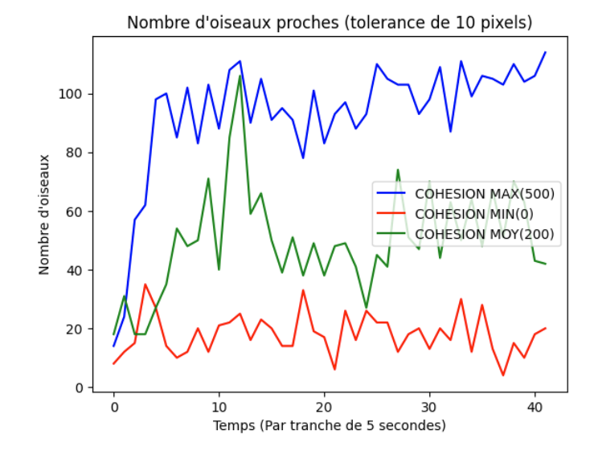
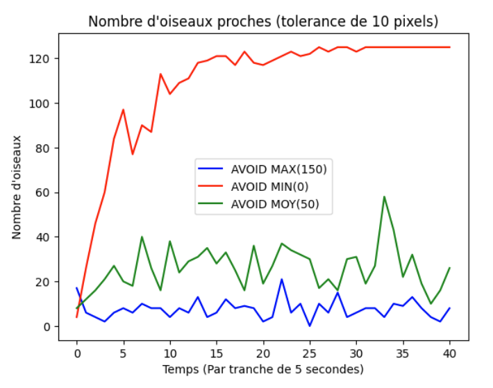
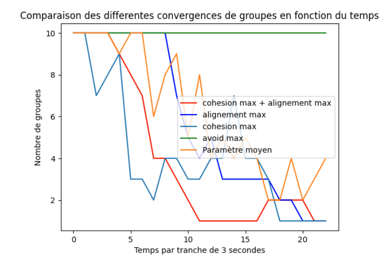

Notre modèle maintenant fonctionnel et évoluant sur la base d’un nombre de paramètres nis, il nous incombe de prendre du recul sur son comportement. Il est inclus dans la dénition de système dynamique: “évolution d’un système au cours du temps”. Il en découle naturellement les questions suivantes:
  - La nuée d'oiseaux après un certain temps est-elle divergente? Convergente? Dépend-elle de la situation initiale ?
  - Les paramètres ont-ils un impact sur le résultat ? Si oui, dans quelles mesures ?
  - A-t-on des résultats réalistes coïncidant avec la vie réelle?

<h2>Méthode d’analyse:</h2>
Pour répondre à toutes ces questions il nous faut:
- Des métriques d'évaluations: des valeurs nous permettant de mesurer un phénomène.
- Une quantication de ces valeurs, ainsi que leurs analyses.

Nous avons donc choisi deux métriques:
- Le nombre de groupes (pouvant aller de 1 à 10)
- Le nombre d’oiseaux relativement proches.

La deuxième métrique est facilement obtenable: il suffit à un instant T, de lancer une fonction qui compte le nombre d’oiseaux proches, selon un critère de proximité prédéni (10 pixels en l'occurrence).
En revanche, le comptage de groupe se révèle complexe: Comment compter correctement des groupes à un instant précis? Facile, voire évident pour l’être humain, et pourtant dicilement réalisable par une machine. Pour permettre à l'ordinateur de sectionner nos oiseaux en diérents groupes, nous utilisons l’algorithme des k-means, pour créer 10 groupes, puis nous fusionnons les groupes dont les extrêmes sont communs à d'autres, ce qui nous fournit un nombre de groupe ni à un instant donné.
Nous avons, pour automatiser cette tâche, crée un système qui toutes les trois secondes retranscrit dans un fichier texte toutes les positions des oiseaux, puis, nous avons créé un Jupyter Notebook pour pouvoir exploiter ces données et appliquer l’algorithme des k-means.

<h2>Résultat obtenus:</h2>
Étudions tout d’abord les résultats relatifs à la proximité des oiseaux. Rappelons que l’on observe la variabilité des valeurs citées précédemment au l du temps, et que chaque simulation est diérente car les oiseaux sont générés aléatoirement avec un vecteur vitesse et une direction aléatoires.

Rappelons également que les paramètres que nous pouvons faire varier sont la taille des trois cercles cités précédemment : l’alignement, qui permet de faire suivre la direction du groupe; la séparation, qui pousse à s'éloigner des oiseaux trop proches; et la cohésion, qui rapproche un oiseau de ceux qui sont dans ces alentours. En faisant varier la taille de ces cercles, diérents nombre d’oiseaux seront pris en compte, ce qui
inuencera le réalisme de notre simulation.
Commençons par étudier la métrique donnant l’aperçu le plus général des comportements: le nombre d’oiseaux respectant une proximité de X pixels (ici, X = 10).
En fixant les deux autres paramètres à des valeurs moyennes, et en faisant uctuer l’alignement, on observe tout de suite un résultat logique de convergence:

    

Ce premier résultat, bien que préliminaire, permet déjà de tirer plusieurs conclusions:
Déjà, si nous n’en étions pas persuadés, il est maintenant clair que les paramètres ont une inuence majeure sur le comportement des oiseaux. En second lieu, il semble que l'alignement applique correctement son inuence, et correspond au rôle qu’on lui a, plus tôt, attribué. En effet, si l’alignement des oiseaux est au maximum, alors tous les oiseaux suivent lamême direction. Ce qui, jusqu'à là, ne les rapproche pas. L’alignement n’a pas pour eet direct de regrouper les oiseaux entre eux, elle ajuste juste les directions, mais grâce à cet ajustement, la cohésion va pouvoir plus facilement former des groupes. On en déduit que même si ce n’est pas l’alignement qui provoque
directement ce rassemblement, sans elle, les oiseaux ne se rassemblent pas.

Continuons à faire varier les paramètres en modiant la cohésion :

    

Concernant ces résultats, ils sont aussi très logiques. Si le cercle de cohésion croit, les oiseaux auront tendance à s'amalgamer avec un plus grand nombre d’oiseaux. Couronnez cela par le fait que chaque oiseau applique ce principe, et la simulation converge très vite vers un nombre élevé d’oiseaux proches. On note encore une fois la puissance et l’importance d’un singulier paramètre: quand bien même les deux autres paramètres xés à des valeurs “justes”, si celui-ci est mis à zéro, la simulation ne fonctionne pas.

Poursuivons en modiant la valeur du paramètre de séparation:

    

Ici encore, on constate un résultat satisfaisant. L’action du paramètre est claire: Si la séparation est minimum, alors les oiseaux ne se repoussent plus, et les autres paramètres rassemblent les oiseaux. Tandis que lors d’une forte séparation, les oiseaux se repoussent alors même qu’ils sont déjà éloignés, il est donc sensé que la courbe ache un nombre “d'oiseaux proches” tournant autour de zéro. On constate de plus l'impact de ce paramètre: même si la séparation est moyenne, cela empêche le système de converger. Analysons maintenant notre deuxième métrique, qui est tout aussi importante, le nombre de groupes. En effet, même si nous savons que deux oiseaux sont proches, ils ne font pas pour autant partie d’un même groupe. La métrique précédente nous fournit donc qu’une mesure relativement naïve de la structure adoptée par les oiseaux.

De plus, le graphe de la cohésion ressemble fortement à celui de l’alignement. Cela s’explique par le fait que à une échelle individuelle, les deux paramètres font la même chose (à savoir orienter les oiseaux dans une direction), c’est pour cela que pour voir l’utilité de chaque paramètre, il est important de créer une autre métrique analysant le système de manière global.

    

Les résultats ici obtenus font encore oce de preuve, mais cette fois ci, de preuve able.
La nuée d’oiseaux converge en général vers un seul groupe lorsque rien ne l’en empêche.
Les conditions qui maximisent la convergence sont bien évidemment une cohésion maximisée, aux côtés d’une séparation minimale, mais on remarque que ce ne sont pas des conditions nécessaires, et que notre programme, tant que les paramètres choisis sont un tant soit peu judicieux, va converger vers une quantité réduite de groupes.
