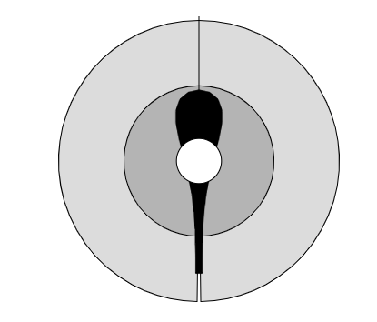

L’algorithme de Boids est utilisé majoritairement en représentation graphique. Il permet de réaliser une
simulation réaliste d’une nuée d'oiseaux ainsi que d'autres créatures se déplaçant en groupe, telles un banc de
poissons, ou un essaim d'insectes.
En raison de la simplicité de son implémentation (que nous allons prochainement aborder) il fait oce de
choix standard dès qu’il s’agit de représenter ce type de comportement.

<h2>Les trois règles fondamentales:</h2>
L’aspect impressionnant de l’algorithme de boids est qu’il repose uniquement sur trois lois relativement
basiques et facilement programmables. Il serait même juste de dire que toute la complexité de l’obtention
d’une simulation réaliste, ainsi que de la coordination entre les trois lois, vient du réglage des paramètres
utilisés.
Avant de comprendre comment ces lois fonctionnent, il est judicieux d'expliquer comment les agents que
nous allons manipuler (les oiseaux) fonctionnent. Dans notre code, chaque oiseau est représenté par un
vecteur. Chaque frame, l’oiseau se déplace via ce vecteur, sa position est donc mise à jour en fonction des
composantes de ce vecteur. Ainsi, ce que l’on va constamment manipuler
pour simuler des mouvements, c’est les vecteurs associés a chaque oiseau.
Finalement, notre oiseau possède aussi trois champs diérents
représentés par des cercles de rayon variables (voir Figure 1). Chaque
cercle va permettre d’appliquer une loi spécique, (ces cercles sont
modulables et font partie des paramètres inuençant notre simulation,
que nous détaillerons plus tard).
Ce point étant clarié, voici les règles:

    

 
<h3>Séparation:</h3>
Chaque individu s'éloigne de ceux qui sont trop proches.
Quand un ou plusieurs individus sont détéctés à l’interieur de la zone
représentant le corps de l’oiseau (le cercle blanc - Figure 1), le vecteur de direction de l’oiseau est modié de
manière à s’eloigner de ceux ci.

<h3>Alignement:</h3>
Chaque individu aligne sa direction sur celle des individus aux alentours.
Quand un ou plusieurs individus entrent dans la zone de vision de l’oiseau (le cercle gris foncé - Figure 1), le
vecteur de direction de l’individu est aligné pour suivre une direction relativement similaire à celle du groupe
dans le cercle.

<h3>Cohésion:</h3>
Chaque individu se rapproche des individus trop éloignés à sa portée.
Quand un ou plusieurs individus entrent dans la deuxième zone de vision (le cercle gris clair - Figure 1), le
vecteur de direction de l’individu va être modié pour qu’il se rapproche des autres individus dans cette
zone.

<h2>Simultanéité des lois:</h2>
Ces trois lois, lorsqu’elles sont activées simultanément, interagissent entre elles :
Simulons l'application des trois lois à un individu. La première a changé son vecteur direction, la deuxième
va aussi le changer et la troisième, idem. Les modications étant successives pour éviter d’avoir un vecteur dû
uniquement à la dernière loi appelée, on utilise la relation de Chasles, grâce à laquelle on obtient un vecteur
combinant les trois lois.

<h2>Le rôle des paramètres:</h2>
Comme précédemment mentionné, chaque zone sur la Figure 1 possède une taille modiable directement
dans le code, ainsi que interactivement via la fenêtre de notre projet. Chaque taille est donc un paramètre
inuençant le rendu nal et le réalisme de notre représentation. Comme déjà évoqué, l’un des aspects les plus complexes de notre projet est l’ajustement de ces paramètres. Pour atteindre une simulation réaliste,
nous avons ané nos paramètres de manière empirique jusqu'à ce qu’a l’obtention d’un rendu satisfaisant,
sans oublier qu'une légère uctuation dans l’un des paramètres nécessite le réajustement des deux autres.
Nous discuterons plus tard dans la section “Choix réalisés” la provenance des valeurs que nous avons décidé
d’associer à nos paramètres et donc à nos tailles de cercles.
