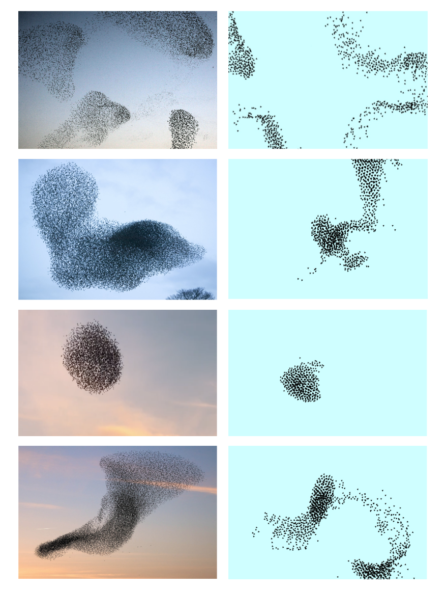

Dans cette section nous vous proposons une brève démonstration de notre simulation.
Afin de valider visuellement notre projet nous avons comparé des images issues de véritables nuées d’oiseaux avec celles générées par notre programme:

    

On remarque que les images d’une nuée naturelle présentent une fluidité et une cohérence que nous avons cherché à recréer artificiellement.
On note que notre simulation parvient à reproduire ces comportements. Les oiseaux se déplacent en formation, adaptant leur direction et leur distance aux mouvements du groupe.

